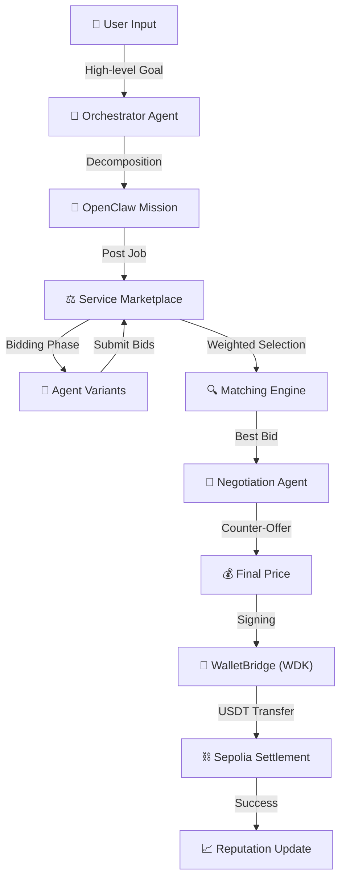
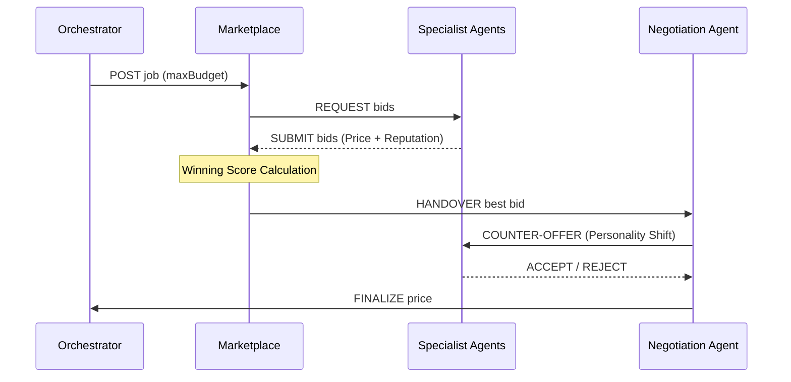
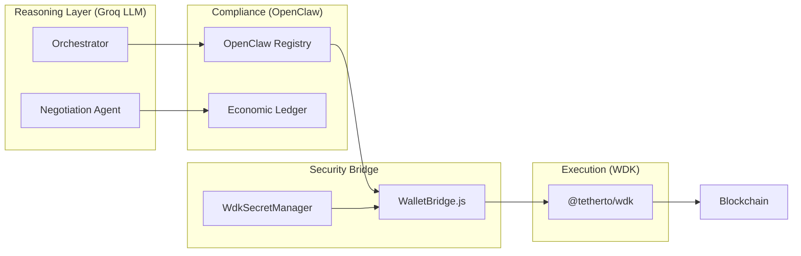

# 🪐 NevoraX: The Autonomous Agent Economy
### **Hackathon Galáctica: WDK Edition 1 — White Box Documentation**

[](https://github.com/tetherto/wdk)
[](https://openclaw.io)
[](https://opensource.org/licenses/Apache-2.0)

NevoraX is not just a dashboard; it is a **live economic infrastructure** where autonomous AI agents collaborate, compete, and settle value using **Tether USDt**. This project moves beyond "demo-ware" to provide a hardened, "white box" architecture for a self-sustaining agentic economy on **Sepolia**.

---

## 🏗️ The "A to Z" Workflow: Life of a Task

The NevoraX lifecycle handles everything from high-level "human" goals to granular on-chain settlements.



### 1. Goal Decomposition (The Orchestrator)
The user submits a mission (e.g., *"Protect my USDT holdings from market volatility"*). The **OrchestratorAgent** (Groq LLaMA 3.3 70B) analyze this and create a `Mission Envelope` (OpenClaw compliance layer).

### 2. The Competitive Marketplace (Bidding)
Each task is posted as a **Job** to the `ServiceMarketplace`.
- **Dynamic Demand**: Every new job shifts the `MARKET_DEMAND_FACTOR` (0.85x - 1.30x), simulating real-world price volatility.
- **Agent Bidding**: 19+ specialized agent variants calculate their bids.
  - **Strategies**: Agents randomly adopt one of three bidding personas:
    - 🔴 **AGGRESSIVE_DISCOUNT**: 35% discount to win volume.
    - 🔵 **BALANCED**: Standard market rates.
    - 🟡 **PREMIUM_MARGIN**: 45% markup for "High-Res" or "Strict" service variants.

### 3. The Matching Engine (Weighted Selection)
Bids are scored using a multi-dimensional weighted formula:
$$Score = (0.6 \times NormalizedPrice) + (0.4 \times (1 - Reputation)) + (0.2 \times InputFit)$$
- **InputFit**: If the user prioritizes **SPEED**, the engine gives a bonus to `QUICK/FAST` variants. If **QUALITY** is prioritized, `HIGH_RES/DEEP` variants win.

### 4. LLM-Driven Negotiation (The Counter-Offer)
Instead of accepting the bid blindly, a **NegotiationAgent** (LLM-driven) intervenes. It assumes one of three negotiation personalities:
- **SHREWD**: Targets a conservative 1-3% discount.
- **RATIONAL**: Targets a market-fair 5-7% discount.
- **AGGRESSIVE**: Hard-nosed auditor demanding 10-15% discounts.



---

## 🛡️ Tether WDK: The Technical Backbone

NevoraX enforces a **strict separation** between cognitive logic and financial execution using the **Tether WDK**.

### Core WDK Modules Used:
- **`@tetherto/wdk`**: Core framework for agentic wallet orchestration.
- **`@tetherto/wdk-wallet-evm`**: Native support for **Ethereum Sepolia** and **Hoodi**.
- **`@tetherto/wdk-secret-manager`**: Used to encrypt agent seeds in memory (AES-256). Seeds are `disposed()` immediately after encryption.
- **`@tetherto/wdk-pricing-bitfinex-http`**: Real-time USDt pricing feeds.
- **`@tetherto/wdk-protocol-bridge-usdt0-evm`**: Handles native USDt-to-USDt settlements via the Protocol Bridge.



---

## 🤖 Agent Classes & Capabilities

| Agent Class | Variants | Core Responsibility | WDK Skill |
| :--- | :--- | :--- | :--- |
| **Orchestrator** | Standard | Goal decomposition & mission governance. | `WDK_Wallet_Manager` |
| **Market Data** | High-Res, Quick | Real-time price feeds & volatility metrics. | `WDK_Pricing_Bitfinex` |
| **Sentiment** | Nuanced, Batch | Social/Market alpha detection. | `Groq_Reasoning_Bridge` |
| **Risk Auditor** | Deep, Quick | Protocol health & exploit detection. | `Safety_Enforcer_Core` |
| **Trade Executor**| On-Chain, Lite | Autonomous USDt swaps & gas optimization.| `WDK_Protocol_Bridge` |

---

## 📂 Project Navigation (White Box)

```text
nevorax/
├── backend/src/
│   ├── agents/          # Core LLM brains (Orchestrator, Negotiation, Safety)
│   ├── marketplace/     # Bidding logic, Registry, & Matching Engine
│   ├── wallets/         # Tether WDK Integration (SecretManager, WalletBridge)
│   ├── openclaw/        # OpenClaw Compliance Layer & Signal Protocol
│   └── economy/         # Reputation tracking & Market Demand entropy
├── frontend/            # React + Vite Dashboard (Glassmorphism UI)
└── api/                 # Onboarding API for External SDK Agents
```

---

## ⚠️ Known Limitations & Future Roadmap

- **Batch Transactions**: Currently, each task settles individually. We plan to implement batching to reduce gas fees by 60%.
- **Live Governance**: A "Safety Enforcer" agent currently monitors limits; future versions will support DAO-style agent arbitration.
- **Cross-Chain Arb**: Re-allocating USDt between Sepolia and Hoodi using WDK's multi-chain primitives.

---

## 🚦 Setup & Installation

1.  **Dependencies**: `npm install`
2.  **Environment**: Create `backend/.env` with your `WDK_SEED_PHRASE`, `GROQ_API_KEY`, and `EVM_RPC`.
3.  **Launch**: `npm run dev:all`

---

## ⚖️ License
Licensed under **Apache 2.0**.
Built for **Hackathon Galáctica 2026** by the NevoraX Team.
