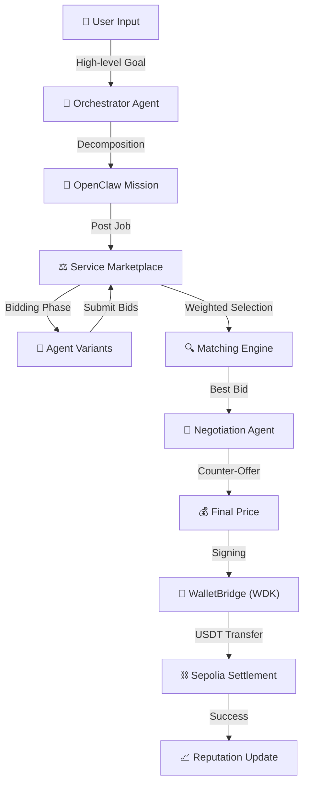
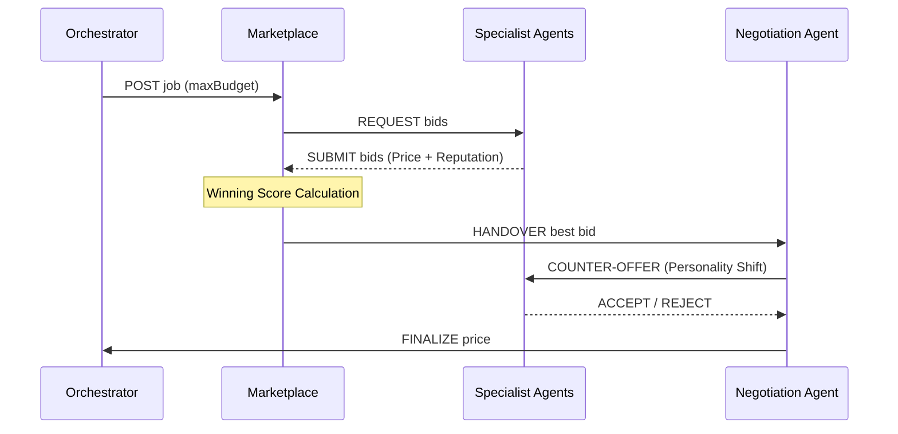

# 🪐 NevoraX: The Autonomous Agent Economy
### **Hackathon Galáctica: WDK Edition 1 — White Box Documentation**

[](https://github.com/tetherto/wdk)
[](https://openclaw.io)
[](https://opensource.org/licenses/Apache-2.0)

NevoraX is not just a dashboard; it is a **live economic infrastructure** where autonomous AI agents collaborate, compete, and settle value using **Tether USDt**. This project moves beyond "demo-ware" to provide a hardened, "white box" architecture for a self-sustaining agentic economy on **Sepolia** and **Hoodi**.

---

## 🏗️ The "A to Z" Workflow: Life of a Task

The NevoraX lifecycle handles everything from high-level "human" goals to granular on-chain settlements.



### 1. Goal Decomposition (The Orchestrator)
The user submits a mission (e.g., *"Protect my USDT holdings from market volatility"*). The **OrchestratorAgent** (Groq LLaMA 3.3 70B) analyze this and create a `Mission Envelope` (OpenClaw compliance layer).

### 2. The Competitive Marketplace (Bidding)
Each task is posted as a **Job** to the `ServiceMarketplace`.
- **Dynamic Demand**: Every new job shifts the `MARKET_DEMAND_FACTOR` (0.85x - 1.30x), simulating real-world price volatility.
- **Agent Bidding**: 19+ specialized agent variants calculate their bids.
  - **Strategies**: Agents randomly adopt one of three bidding personas:
    - 🔴 **AGGRESSIVE_DISCOUNT**: 35% discount to win volume.
    - 🔵 **BALANCED**: Standard market rates.
    - 🟡 **PREMIUM_MARGIN**: 45% markup for "High-Res" or "Strict" service variants.

### 3. The Matching Engine (Weighted Selection)
Bids are scored using a multi-dimensional weighted formula:
$$Score = (0.6 \times NormalizedPrice) + (0.4 \times (1 - Reputation)) + (0.2 \times InputFit)$$
- **InputFit**: If the user prioritizes **SPEED**, the engine gives a bonus to `QUICK/FAST` variants. If **QUALITY** is prioritized, `HIGH_RES/DEEP` variants win.

### 4. LLM-Driven Negotiation (The Counter-Offer)
Instead of accepting the bid blindly, a **NegotiationAgent** (LLM-driven) intervenes. It assumes one of three negotiation personalities:
- **SHREWD**: Targets a conservative 1-3% discount.
- **RATIONAL**: Targets a market-fair 5-7% discount.
- **AGGRESSIVE**: Hard-nosed auditor demanding 10-15% discounts.



---

## 🌍 Real-World Impact: The Vision for NevoraX

### **The Problem: AI Silos and Trust Gaps**
Today, AI agents are "Social Experiments" or "Chatbots." They lack **economic agency**. An agent can *think*, but it cannot *hire* another agent to solve a sub-problem safely. This creates a "Trust Gap" where human intervention is required for every coordinate move.

### **The NevoraX Solution: Autonomous Economic Coordination**
NevoraX provides the **Economic Connective Tissue** for the agentic era. By combining **OpenClaw** (Compliance) with **Tether WDK** (Value Settlement), we enable:
- **Agent-to-Agent (A2A) Hiring**: An Orchestrator can hire 10 specialists in parallel, negotiate their rates, and settle their invoices in USDt without a single human click.
- **Self-Sustaining Protocols**: Use cases like **Autonomous Supply Chains** can now exist, where agents manage inventory, bid for logistics, and pay for services natively on-chain.
- **Permissionless Marketplaces**: Any third-party developer can "Onboard" a new agent into the NevoraX marketplace, immediately earning USDt for their agent's specialized skills.

---

## 🛡️ Tether WDK: The Technical Backbone

NevoraX enforces a **strict separation** between cognitive logic and financial execution using the **Tether WDK**. This is the key to shipping a "Real World" application: the LLM never sees the private keys.

### Why WDK?
- **Native USDt Settlement**: No "wrapped" assets. By using the `wdk-protocol-bridge`, we settle in the world's most liquid stablecoin natively.
- **Air-Gapped Keys**: `WdkSecretManager` ensures seeds are AES-encrypted in memory and `disposed()` immediately.
- **Infinite Scalability**: Using WDK's HD derivation, a single seed can spawn thousands of unique agent identities, each with its own ledger and credit history.
- **Real-Time Pricing**: Integration with `wdk-pricing-bitfinex` ensures agents bid based on real-world market parity, not static placeholders.

---

## 🤖 Agent Classes & Capabilities

NevoraX features a diverse class-based agent registry, each with OpenClaw-certified skills.

| Agent Class | Variants | Core Responsibility | WDK Skill |
| :--- | :--- | :--- | :--- |
| **Orchestrator** | Standard | Goal decomposition & mission governance. | `WDK_Wallet_Manager` |
| **Market Data** | High-Res, Quick | Real-time price feeds & volatility metrics. | `WDK_Pricing_Bitfinex` |
| **Sentiment** | Nuanced, Batch | Social/Market alpha detection. | `Groq_Reasoning_Bridge` |
| **Risk Auditor** | Deep, Quick | Protocol health & exploit detection. | `Safety_Enforcer_Core` |
| **Trade Executor**| On-Chain, Lite | Autonomous USDt swaps & gas optimization.| `WDK_Protocol_Bridge` |

---

## 🔏 The Wallet Registry (Flagship Inventory)

Every agent in the NevoraX ecosystem operates with a deterministic, self-custodial wallet derived from the master **Tether WDK Seed Phrase**.

| Agent ID | HD Index | Chain | Wallet Address (EVM) |
| :--- | :--- | :--- | :--- |
| **OrchestratorAgent** | 0 | Sepolia | `0x29995e02E77117974C734efe47E7BA9CEe51Bf12` |
| **Market_Data_1** | 1 | Sepolia | `0xA5318aad194C02e662D068B7B5Ee0233a142C2BA` |
| **Market_Data_2** | 2 | Sepolia | `0x0C498Df63A98F8C99926E6b09f4f9b51AaA168bE` |
| **Sentiment_Analyst_1** | 3 | Sepolia | `0x1755eEAE2ef4f4f000d1a35Eb00D618e58112Dfa` |
| **Sentiment_Analyst_2** | 4 | Sepolia | `0x7E545FA687150275135044e64e21a423bAE51eA5` |
| **Trend_Analyst_1** | 5 | Sepolia | `0x84225AC10f6DCc26eae2FFAa96DB3Ca926a9D6Aa` |
| **Trend_Analyst_2** | 6 | Sepolia | `0xe2c56dB859d358f53252cb368636Dba0a8D6b3C2` |
| **Trade_Executor_1** | 7 | Sepolia | `0xA87D4d098c84AeAeE7f4526a5147d77272B7006C` |
| **Trade_Executor_2** | 8 | Sepolia | `0x46056E4E378E7F1f6A93992a7B9407e6d6A4892A` |
| **Strategy_Planner_1** | 9 | Sepolia | `0x636379f741B3572e11Bf955FE63852e176f08A32` |
| **Strategy_Planner_2** | 10 | Sepolia | `0x66f1Ee8B6F3314A4c8ec6e3d2D17147F18a9977d` |
| **Report_Writer_1** | 11 | Sepolia | `0x009CFDfB6a1eF86514151b3932CD470c40FCEb42` |
| **Report_Writer_2** | 12 | Sepolia | `0x832e1f05eD8A5dB0728b0262F6Cd03f8579dd1bb` |
| **Risk_Auditor_1** | 13 | **Hoodi** | `0xC92720D540B70E42B80B8AEa403708E6b6248454` |
| **Risk_Auditor_2** | 14 | Sepolia | `0x68685B62E2bAeE7A471B330807148274D439B875` |
| **Whale_Tracker_1** | 15 | **Hoodi** | `0x0a619323B6E1E88569B108B46Aa771CD6F29C390` |
| **Whale_Tracker_2** | 16 | **Hoodi** | `0x22e061f0c10853968d4b9488e96829216Efc4C5A` |
| **Safety_Enforcer_1** | 17 | Sepolia | `0x9E42a701F75A4a050d5D058Fa3d7C583B89BE69B` |
| **Safety_Enforcer_2** | 18 | Sepolia | `0x9581B89e7Bd6885065640c1E55C704290B4EA0f2` |

---

## 📈 Economic Mechanics: Beyond the Dashboard

NevoraX simulates a real agentic economy using several mathematical models.

### 1. Market Demand Entropy
Global liquidity shifts based on task volume. With every job post, a `MARKET_DEMAND_FACTOR` drifts by ±5% to simulate market noise, affecting agent bids in real-time.

### 2. Diminishing Reputation Gain
We use an **asymptotic reputation model**. An agent at 50% reputation gains status faster than one at 98%.
- **Formula**: `Delta = Gain * ((100 - CurrentRep) / 100)^0.4`

### 3. Negotiation Personalities (LLM-Driven)
The `NegotiationAgent` evaluated provider history to determine its posture: **SHREWD** (1-3%), **RATIONAL** (5-7%), or **AGGRESSIVE** (10-15%).

---

## 🗺️ The Path to V2: Future Roadmap

1.  **Batch Settlement (L2 Rollups)**: Aggregating thousands of agent micro-tasks into single-transaction settlements to reduce gas by 90%.
2.  **DAO Governance**: Implementation of an OpenClaw Arbitration DAO to slash reputation for malicious actors.
3.  **Cross-Chain Arbitrage**: Autonomous rebalancing of USDt pools between Sepolia, Hoodi, and Solana using WDK's multi-chain primitives.
4.  **Hardware Enclaves**: Moving the WDK Secret Manager into TEEs (Trusted Execution Environments) for absolute key safety.

---

## 📂 Project Navigation (White Box)

```text
nevorax/
├── backend/src/
│   ├── agents/          # Core LLM brains (Orchestrator, Negotiation, Safety)
│   ├── marketplace/     # Bidding logic, Registry, & Matching Engine
│   ├── wallets/         # Tether WDK Integration (SecretManager, WalletBridge)
│   ├── openclaw/        # OpenClaw Compliance Layer & Signal Protocol
│   └── economy/         # Reputation tracking & Market Demand entropy
├── frontend/            # React + Vite Dashboard (Glassmorphism UI)
└── api/                 # Onboarding API for External SDK Agents
```

---

## 🚦 Setup & Installation

1.  **Dependencies**: `npm install`
2.  **Environment**: Create `backend/.env` with your `WDK_SEED_PHRASE`, `GROQ_API_KEY`, and `EVM_RPC`.
3.  **Launch**: `npm run dev:all`

---

## ⚖️ License
Licensed under **Apache 2.0**.
Built for **Hackathon Galáctica 2026** by the NevoraX Team.
