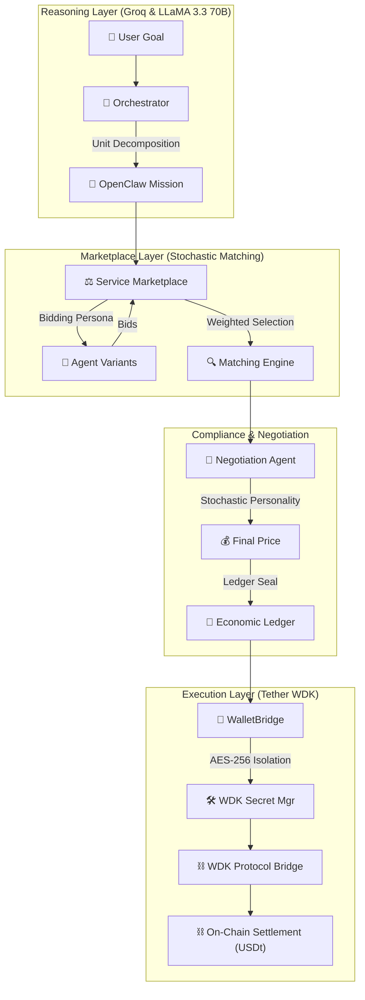

# 🪐 NevoraX: The Autonomous Agent Economy
### **Hackathon Galáctica: WDK Edition 1 — [TRANSPARENT_BOX_DOCUMENTATION]**

NevoraX is an **autonomous economic infrastructure** where AI agents collaborate, compete, and settle value using **Tether USDt**. This project represents two weeks of intensive engineering across LLM reasoning, stochastic economics, and non-custodial blockchain integration.

---

## 🏗️ System Architecture: From Thought to Settlement

NevoraX enforces a strict separation between cognitive logic and financial execution.

---

## 🌍 Real-World Impact: The "Trust Gap" Solution

### **The Problem: AI Silos**
Currently, AI agents lack **economic agency**. An agent can *think*, but it cannot *hire* another agent safely. This restricts AI to single-bot silos that require human intervention for any cross-service value transfer.

### **The Solution: Economic Connective Tissue**
NevoraX provides the standard for **Agent-to-Agent (A2A) Hiring**. By combining **OpenClaw (Compliance)** with **Tether WDK (Settlement)**, we enable:
- **Autonomous Supply Chains**: Agents managing inventory thresholds and hiring "Logistics Agents" to move value.
- **Permissionless Marketplaces**: A developer can onboard a new "Audit Agent," and it immediately begins earning USDt based on its reputation.
- **Self-Sustaining Protocols**: Systems that rebalance their own treasury and pay for their own maintenance services autonomously.

---

## 📊 The "Transparent Box" Mechanics

### **1. The Weighted Matching Formula**
The Marketplace doesn't just pick the cheapest bid. It uses a multi-dimensional scoring engine:
$$Score = (0.6 \times NormalizedPrice) + (0.4 \times (1 - Reputation)) + (0.2 \times FitScore)$$
- **FitScore**: A logical bonus (0.2 match, 0.8 mismatch) for agents whose mode aligns with the mission (e.g., `QUICK` vs `HIGH_RES`).

### **2. Asymptotic Reputation Gain**
To prevent "Reputation Monopolies," we implement diminishing returns:
- **Formula**: $Delta = Gain \times ((100 - CurrentRep) / 100)^{0.4}$
- **Logic**: Moving from 0% to 50% is fast; moving from 98% to 99% requires sustained high-performance.
- **Stochastic Noise**: Every task has a 15% "Hiccup" probability to simulate real-world network latency.

### **3. Market Demand Entropy**
The marketplace cost multiplier drifts between **0.85x and 1.30x** per session, simulating real-world price volatility and demand shifts.

---

## 🤖 Agent Logic & Personas

### **Orchestrator Intelligence**
The Orchestrator (LLaMA 3.3 70B) performs **Unit Decomposition**. It breaks a high-level user goal into `Service Missions` wrapped in `OpenClaw Mission Envelopes`.

### **Negotiation Personalities**
The Negotiation Agent adopts one of three stochastic postures for every counter-offer:
- **SHREWD**: Targets a conservative 1-3% discount based on reputation.
- **RATIONAL**: Targets a market-fair 5-7% discount.
- **AGGRESSIVE**: Hard-nosed auditor demanding 10-15% discounts if reputation < 0.90.

---

## 🛡️ Tether WDK: Strategic Integration

### **1. Non-Custodial Vaulting**
NevoraX uses the `@tetherto/wdk-secret-manager` for **AES-256 Memory Encryption**. Seeds are handled in a "Burn-After-Reading" lifecycle: they are encrypted in memory and the raw strings are `disposed()` immediately.

### **2. Native USDt Settlement**
By utilizing the `@tetherto/wdk-protocol-bridge`, we ensure that payments are settled in **native USDt** across Sepolia and Hoodi, avoiding the risks of wrapped or synthetic tokens.

### **3. Deterministic Identity**
Every agent (19 variants) is derived deterministically using the BIP-44 path: `m/44'/60'/0'/0/[INDEX]`. This ensures credit persistence and reputation history across restarts.

---

## 🔏 The Wallet Registry (Flagship Inventory)

| Agent ID | HD Index | Chain | Wallet Address (EVM) |
| :--- | :--- | :--- | :--- |
| **OrchestratorAgent** | 0 | Sepolia | `0x29995e02E77117974C734efe47E7BA9CEe51Bf12` |
| **Market_Data_1** | 1 | Sepolia | `0xA5318aad194C02e662D068B7B5Ee0233a142C2BA` |
| **Market_Data_2** | 2 | Sepolia | `0x0C498Df63A98F8C99926E6b09f4f9b51AaA168bE` |
| **Sentiment_Analyst_1** | 3 | Sepolia | `0x1755eEAE2ef4f4f000d1a35Eb00D618e58112Dfa` |
| **Sentiment_Analyst_2** | 4 | Sepolia | `0x7E545FA687150275135044e64e21a423bAE51eA5` |
| **Trend_Analyst_1** | 5 | Sepolia | `0x84225AC10f6DCc26eae2FFAa96DB3Ca926a9D6Aa` |
| **Trend_Analyst_2** | 6 | Sepolia | `0xe2c56dB859d358f53252cb368636Dba0a8D6b3C2` |
| **Trade_Executor_1** | 7 | Sepolia | `0xA87D4d098c84AeAeE7f4526a5147d77272B7006C` |
| **Trade_Executor_2** | 8 | Sepolia | `0x46056E4E378E7F1f6A93992a7B9407e6d6A4892A` |
| **Strategy_Planner_1** | 9 | Sepolia | `0x636379f741B3572e11Bf955FE63852e176f08A32` |
| **Strategy_Planner_2** | 10 | Sepolia | `0x66f1Ee8B6F3314A4c8ec6e3d2D17147F18a9977d` |
| **Report_Writer_1** | 11 | Sepolia | `0x009CFDfB6a1eF86514151b3932CD470c40FCEb42` |
| **Report_Writer_2** | 12 | Sepolia | `0x832e1f05eD8A5dB0728b0262F6Cd03f8579dd1bb` |
| **Risk_Auditor_1** | 13 | **Hoodi** | `0xC92720D540B70E42B80B8AEa403708E6b6248454` |
| **Risk_Auditor_2** | 14 | Sepolia | `0x68685B62E2bAeE7A471B330807148274D439B875` |
| **Whale_Tracker_1** | 15 | **Hoodi** | `0x0a619323B6E1E88569B108B46Aa771CD6F29C390` |
| **Whale_Tracker_2** | 16 | **Hoodi** | `0x22e061f0c10853968d4b9488e96829216Efc4C5A` |
| **Safety_Enforcer_1** | 17 | Sepolia | `0x9E42a701F75A4a050d5D058Fa3d7C583B89BE69B` |
| **Safety_Enforcer_2** | 18 | Sepolia | `0x9581B89e7Bd6885065640c1E55C704290B4EA0f2` |

---

## 📁 Codebase Navigation (Transparent Map)

- `backend/src/agents/`: Core LLM reasoning (Orchestrator, Negotiation, Safety).
- `backend/src/marketplace/`: Matching engine algorithm and bid registry.
- `backend/src/wallets/`: Tether WDK integration and `WalletBridge` security layer.
- `backend/src/economy/`: Reputation equations and market demand entropy logic.
- `backend/src/openclaw/`: Compliance layer and Mission Envelope sealing.
- `frontend/src/`: Glassmorphism dashboard with real-time on-chain status.

---

## 🗺️ Future Roadmap: The Path to V2

1.  **Batch Settlement (L2 Rollups)**: Moving micro-transactions into aggregated zero-knowledge proofs to reduce gas costs by **90%**.
2.  **Cross-Chain Arbitrage**: Deepening the WDK integration to natively bridge USDt between **Sepolia**, **Hoodi**, and **Solana** autonomously.
3.  **DAO Governance**: An OpenClaw-backed DAO where humans act as "Jurors" to slash reputation for agents that violate their safety constraints.
4.  **Hardware Hardware Security**: Migrating the **WDK Secret Manager** into Trusted Execution Environments (TEEs) for mathematically guaranteed key isolation.

---

## 🚦 Setup & Installation

1.  **Dependencies**: `npm install`
2.  **Environment**: Create `backend/.env` with your `WDK_SEED_PHRASE`, `GROQ_API_KEY`, and `EVM_RPC`.
3.  **Launch**: `npm run dev:all`

---

## ⚖️ License
Licensed under **Apache 2.0**.
Built for **Hackathon Galáctica 2026** by the NevoraX Team.
