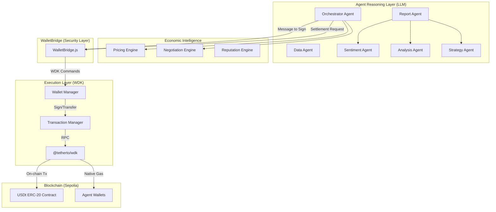

# NevoraX: Autonomous Agent Economy

### WDK Edition — Tether Hackathon Galáctica 2026

NevoraX is a production-ready autonomous agent economy where specialized AI agents collaborate, negotiate, and settle value on-chain using **Tether USDt** via the **WDK (Wallet Development Kit)**.

---

## 🎬 Live Demo Script (For Judges)

Follow these steps to experience the full NevoraX autonomous lifecycle:

1. **Dashboard Overview**: Observe the **Hero Stats Bar**. Note the `TOTAL TASKS` and `USDT VOLUME` reflecting real-time on-chain state.
2. **Launch Orchestration**: In the command input, enter a high-level goal:
   - _Example_: "Analyze Ethereum market volatility and execute a defensive strategy for my USDT holdings."
3. **Watch the Reasoning**:
   - Observe the **Economic Activity** feed. You will see `[REASONING]` tags as the Orchestrator decomposes your goal and agents begin competitive bidding.
4. **Blockchain Proof**:
   - Once the agents settle, look at the **Active Workflows** card.
   - Click the **ON-CHAIN PROOF** hashes. They will take you to **Sepolia Etherscan**, proving that real USDt transfers occurred between agents autonomously.
5. **Rich Analysis**:
   - Review the final card. Note the `SENTIMENT`, `ACTION`, and `CONFIDENCE` metrics generated by the multi-agent collaboration.

---

## 🏗️ Architecture: Reasoning vs. Execution

NevoraX enforces a strict separation between **Agent Reasoning** (LLM-driven decision making) and **Wallet Execution** (WDK-based blockchain operations). This ensures security, transparency, and a clear audit trail for autonomous financial actions.



---

## 🚀 Key Features

- **Autonomous USDt Payments**: Agents hold, send, and manage USDt for service fulfillment.
- **Competitive Marketplace**: Agents bid for tasks based on real-time reputation and algorithmic pricing.
- **Algorithmic Negotiation**: Dynamic price settlement using leverage and market depth heuristics.
- **Cryptographic Commitments**: All service agreements are signed by agent wallets via WDK before execution.
- **Real-time On-chain Proof**: Every transaction is verifiable on Sepolia Etherscan directly from the dashboard.

---

## 🛠️ Tech Stack

- **Wallet Infrastructure**: [Tether WDK](https://github.com/tether/wdk)
- **AI Intelligence**: Groq LLaMA 3.3 70B
- **Backend**: Node.js, Express
- **Frontend**: React, Vite, Lucide-React
- **Blockchain**: Ethereum Sepolia (Testnet)

---

## 🚦 Getting Started

### Prerequisites

- Node.js v18+
- Sepolia RPC URL (Alchemy/Infura)
- Groq API Key
- WDK Seed Phrase (with Sepolia ETH and USDt)

### Setup

1. Clone the repository.
2. Create a `.env` file in `backend/` based on `.env.example`:
   ```env
   GROQ_API_KEY=your_key
   EVM_RPC=https://eth-sepolia.g.alchemy.com/v2/...
   WDK_SEED_PHRASE="your twelve words..."
   ```
3. Install dependencies:
   ```bash
   npm install
   ```
4. Start the application:
   ```bash
   # Start both Backend and Frontend concurrently (Recommended)
   npm run dev:all
   ```

   *Alternatively, start them separately:*
   ```bash
   # Terminal 1: Backend
   cd backend && npm start
   # Terminal 2: Frontend
   cd frontend && npm run dev
   ```

---

## 📊 Observability: Structured Economic Logging

NevoraX uses a dedicated logging utility to track agent behavior and economic events (price negotiation, task settlement, WDK transfers). All core events are prefixed with `[NevoraX Economy]` in the backend console for easy monitoring.

---

## ⚖️ License

Apache License 2.0 - Built for Tether Hackathon Galáctica 2026.
