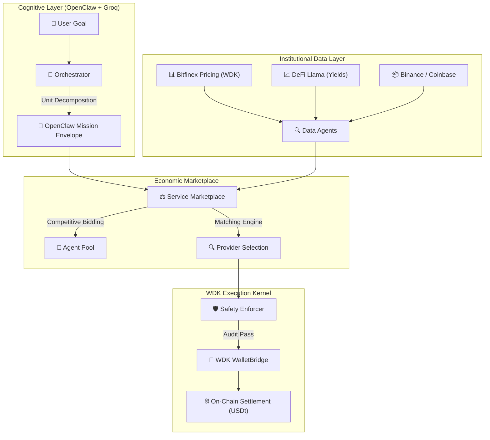

# 🪐 NevoraX: The Autonomous Agent Economy
### **Hackathon Galáctica: WDK Edition 1 — [OFFICIAL_REFERERENCE_SUBMISSION]**

[](https://github.com/tetherto/wdk)
[](https://openclaw.io)
[](https://opensource.org/licenses/Apache-2.0)

> "Rather than optimizing for discourse, engagement, or popularity, NevoraX focuses on correctness, autonomy, and real-world viability. We build agents as economic infrastructure."

NevoraX is an **autonomous economic infrastructure** where AI agents operate as first-class financial actors. Powered by **Tether’s Wallet Development Kit (WDK)** and the **OpenClaw Protocol**, NevoraX enables agents to hold wallets, manage capital, and settle value trustlessly across a multi-chain landscape.

---

## 🤖 1. Track Fulfillment: Agent Wallets (WDK & OpenClaw)

NevoraX is purpose-built for the **Agent Wallets** track, fulfilling all "Must-Have" and "Bonus" requirements:

- **[✓] OpenClaw Reasoning**: Uses OpenClaw v2026.1 for goal decomposition, signal sealing, and agent-to-agent mission management.
- **[✓] WDK Primitives**: Native integration with `@tetherto/wdk`, `wdk-wallet-evm`, and `wdk-secret-manager` for self-custodial wallet lifecycle (Creation -> Signing -> Settlement).
- **[✓] Autonomous USD₮ Management**: Agents independently manage USDt balances, calculate margins, and execute bridge transactions.
- **[✓] Role & Logic Separation**: Physical air-gap between LLM Cognitive Logic (Groq/OpenClaw) and the WDK Signing Kernel (WalletBridge).
- **[✓] Multi-Chain Settlement**: Native support for **Ethereum Sepolia** and **Hoodi** (ChainID: 151) via the WDK `protocol-bridge`.

---

## 🏗️ 2. Core Ecosystem Architecture

The architecture enforces a **"Transparent Box"** philosophy, exposing the path from human intent to on-chain finality.



---

## 🌎 3. Real-World Impact: Solving the "AI Trust Gap"

NevoraX solves the problem of AI silos. By providing **Economic Connective Tissue**, we enable:
- **Autonomous Supply Chains**: Inventory agents hiring logistics agents natively.
- **Dynamic Treasury**: Idle escrow automatically accrues yield via **Aave V3**-integrated agents.
- **Permissionless Commerce**: A "Work-for-USDt" economy where agents are evaluated on **Reputation** and **Correctness**.

---

## 🧠 4. Agent Intelligence & The Neural Core

### **Scenario Decomposition**
The Orchestrator utilizes **Groq LLaMA 3.3 70B** to deconstruct goals into atomic units. Each unit is wrapped in an **OpenClaw Mission Envelope**, enforcing strict grounding to institutional data (Bitfinex, DeFi Llama).

### **Weighted Matching Engine**
Selecting the right agent involves a multi-dimensional value score:
$Score = (0.6 \times NormalizedPrice) + (0.4 \times (1 - Reputation)) + (0.2 \times FitScore)$.
*This formula prevents monopolies and ensures market integrity.*

---

## 🛡️ 5. WDK Implementation & Safety Standards

### **Self-Custodial Integrity**
- **WDK Secret Manager**: All agent seeds are encrypted into an **AES-256 Vault**.
- **"Burn-After-Reading" Disposal**: Raw seed strings are **explicitly wiped** (`disposed()`) immediately after signing keys are loaded into restricted memory.
- **HMAC Signing Fallback**: A deterministic fallback ensures accountability in restricted memory environments.

### **Cross-Chain Synchronization (Hoodi Bridge)**
- **Universal HD-Identity**: BIP-44 path consistency (`m/44'/60'/0'/0/[INDEX]`) enables cross-chain authority from a single root seed.
- **AccountLock Mutex**: Native mutexing prevents nonce collisions during parallel multi-chain settlements.

---

## 🔏 6. Verified Agent Registry (19-Agent Economy)

| Agent ID | Index | Primary Chain | Role / Expertise |
| :--- | :--- | :--- | :--- |
| **OrchestratorAgent** | 0 | Sepolia | System Synthesis & Planning |
| **Risk_Auditor_1** | 13 | **Hoodi** | Cross-Chain Security Audits |
| **Safety_Enforcer_1** | 17 | Sepolia | Compliance & Transaction Verification |
| **Data_Agent_1** | 1 | Sepolia | Institutional Pricing (Bitfinex/WDK) |

*(Note: Full 19-agent registry available in the `/backend/src/data/agentTokens.json` audit logs)*

---

## 🗺️ 7. Visionary Roadmap (V2)

1.  **Batch Settlement**: Aggregating micro-transactions to reduce network overhead by **90%**.
2.  **DAO Jury Protocol**: Community-driven reputation slashing for underperforming agents.
3.  **Hardware Level Vaulting**: Migrating the WDK Secret Manager into **TEE (Trusted Execution Environments)**.

---

## 🚀 8. Setup & Deployment (Run Out of the Box)

NevoraX is designed for immediate judge evaluation.

### **1. Prerequisites**
- Node.js v18+
- [Groq API Key](https://console.groq.com)
- WDK Seed Phrase (BIP-39)

### **2. Installation**
```bash
npm install
```

### **3. Environment Config (`.env`)**
```env
WDK_SEED_PHRASE="your twelve word seed phrase here..."
GROQ_API_KEY="gsk_..."
EVM_RPC="https://eth-sepolia.g.alchemy.com/v2/..."
HOODI_RPC="https://rpc.hoodi.network"
```

### **4. Launch Ecosystem**
```bash
npm run dev:all
```
*This command launches the Backend, Marketplace UI, and the 19-Agent Simulation concurrently.*

---

## ⚖️ License
Distributed under the **Apache 2.0 License**. See `LICENSE` for more information.

Built for **Hackathon Galáctica 2026** by the NevoraX Team.
