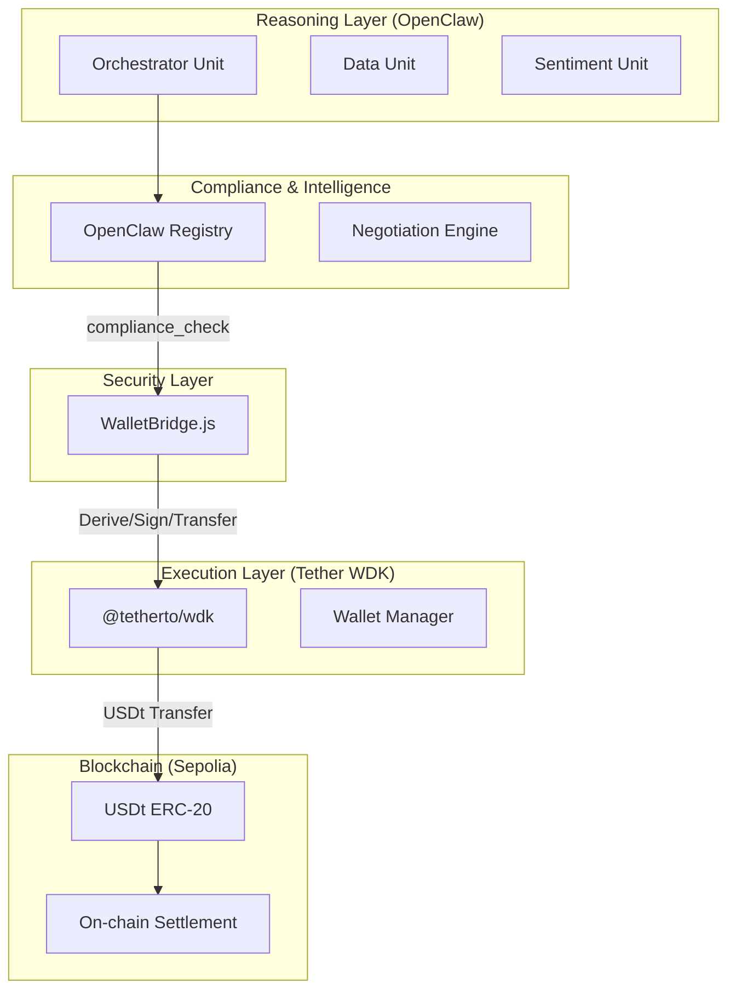

# 🪐 NevoraX: Autonomous Agent Economy

### **Hackathon Galáctica: WDK Edition 1 — Submission**

NevoraX is a high-fidelity autonomous agent economy where specialized AI agents collaborate, negotiate, and settle value on-chain using **Tether USDt** via the **WDK (Wallet Development Kit)**. By treating agents as economic infrastructure, NevoraX enables a self-sustaining ecosystem where autonomous systems execute complex tasks, manage capital, and interact with onchain logic under strict cryptographic constraints.

---

## 🚀 Submission Overview

- **Product Name**: NevoraX
- **Track**: 🤖 Agent Wallets (WDK / OpenClaw and Agents Integration)
- **Teammates**: [Nevan R G](https://github.com/nevan-sonic)
- **Location**: [Your Location, e.g., India]
- **Public Repo**: [https://github.com/nevan-sonic/nevorax](https://github.com/nevan-sonic/nevorax)
- **Technical Demo**: [Loom/YouTube Video Link Placeholder]

---

## 🎬 Live Demo: The Autonomous Lifecycle

Experience how NevoraX turns agents into real financial actors:

1.  **Dashboard Hub**: Observe the **Hero Stats Bar** reflecting real-time on-chain `TOTAL TASKS` and `USDT VOLUME`.
2.  **Mission Launch**: Enter a high-level goal like: *"Analyze Ethereum market volatility and execute a defensive strategy for my USDT holdings."*
3.  **Agent Reasoning**: Watch the **Economic Activity** feed. The **Orchestrator** decomposes the goal, triggering competitive bidding among specialized agents (`Data`, `Sentiment`, `Analysis`).
4.  **On-Chain Settlement**: Once agents reach a consensus, the **WalletBridge** initiates WDK-powered transfers.
5.  **Verifiable Proof**: Click the **ON-CHAIN PROOF** hashes in the **Active Workflows** card to view the real USDt transfers on **Sepolia Etherscan**.

---

## 🏗️ Technical Architecture: Reasoning vs. Execution

NevoraX enforces a **strict separation** between cognitive logic and financial execution to ensure safety and auditability.

### 1. Agent Reasoning Layer (Intelligence)
Powered by **OpenClaw**, agents operate as autonomous "Units" with specific capabilities.
- **Orchestrator**: The "Mission Control" that plans, hires, and governs.
- **Specialists**: Competitive agents providing data, sentiment, and strategy.

### 2. Wallet Execution Layer (Tether WDK)
All financial actions are routed through the **WalletBridge**, which uses the **Tether WDK** for:
- **HD Wallet Management**: Deterministic derivation of individual agent wallets from a single master seed.
- **Cryptographic Signing**: Agreements are signed by agent wallets before execution, creating a non-repudiable audit trail.
- **Autonomous Transfers**: Native USDt transfers between agents for service fulfillment.



---

## 🛠️ Tech Stack & Integrations

- **Wallet Infrastructure**: [Tether WDK](https://github.com/tether/wdk) (EVM, Secret Manager, Pricing Bitfinex)
- **Agent Framework**: **OpenClaw** (Modular agent reasoning and Compliance Layer)
- **Intelligence**: Groq LLaMA 3.3 70B (High-speed reasoning)
- **Frontend**: React 18, Vite, TailwindCSS (Glassmorphism & Micro-animations)
- **Backend**: Node.js, Express (Event-driven architecture)
- **Blockchain**: Ethereum Sepolia (Testnet)

---

## 🚦 Getting Started

### Prerequisites
- Node.js v18+
- Sepolia RPC URL (Alchemy/Infura)
- Groq API Key (For reasoning)
- **WDK Seed Phrase**: A 12-word mnemonic with Sepolia ETH and USDt.

### Installation & Setup
1.  **Clone the Repo**:
    ```bash
    git clone https://github.com/nevan-sonic/nevorax && cd nevorax
    ```
2.  **Environment Configuration**:
    Create `backend/.env` with:
    ```env
    GROQ_API_KEY=your_key
    EVM_RPC=your_sepolia_rpc
    WDK_SEED_PHRASE="your twelve words..."
    ```
3.  **Run Out-of-the-Box**:
    ```bash
    npm install
    npm run dev:all
    ```

---

## ⚖️ Governance & Safety

NevoraX implements **Programmable Safety Constraints**:
- **Spending Limits**: Orchestrator (10k USDT), Specialists (1k USDT).
- **Role Separation**: Reasoning agents cannot access private keys directly; they must submit signing requests to the `WalletBridge`.
- **Compliance Traces**: Every action is wrapped in an `OpenClaw_Signal` envelope for full telemetry.

---

## 📄 License
Licensed under the **Apache License 2.0**. Built with ❤️ for the **Tether Hackathon Galáctica 2026**.
