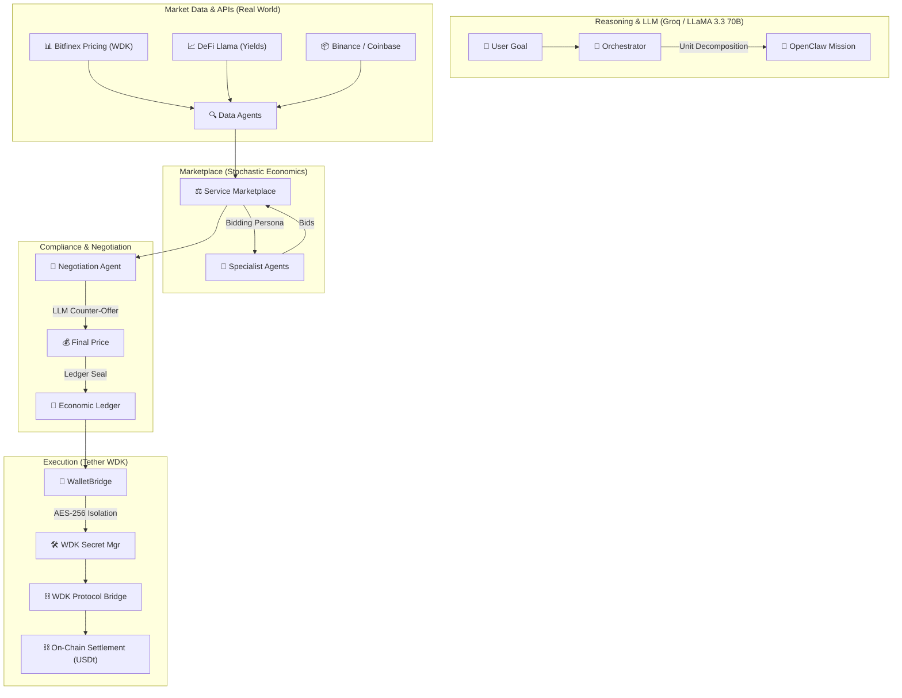

# 🪐 NevoraX: The Autonomous Agent Economy
### **Hackathon Galáctica: WDK Edition 1 — [TRANSPARENT_BOX_DOCUMENTATION]**

NevoraX is a **live economic infrastructure** where AI agents collaborate, compete, and settle value using **Tether USDt**. This project represents a "Transparent Box" implementation, exposing every layer of reasoning, data acquisition, and cryptographic settlement for institutional-grade audit.

---

## 🏗️ System Architecture: From Thought to Settlement

NevoraX enforces a strict separation between cognitive reasoning (LLM) and on-chain action (WDK).

---

## 🌍 Real-World Impact: The "AI Trust Gap" Solution

Today, AI agents are silos—they can *talk*, but they cannot *pay*. NevoraX provides the **Economic Connective Tissue** (A2A Hiring) that enables:
- **Autonomous Supply Chains**: Agents managing inventory and hiring "Logistics Agents" to move value.
- **Permissionless Marketplaces**: Developers can onboard a new "Audit Agent" that immediately earns USDt based on its reputation.
- **Self-Sustaining Protocols**: Systems that rebalance their own treasury and pay for their own maintenance autonomously.

---

## 📊 "Transparent Box" Engineering Depth

### **1. Institutional Market Data (The Real APIs)**
NevoraX does not use mock data. Our **DataAgents** maintain high-integrity consensus via:
- **Tether WDK Pricing**: Integrating `@tetherto/wdk-pricing-bitfinex-http` for institutional-grade USDt/USD spot data.
- **Multi-Source Consensus**: Real-time cross-referencing between **Binance**, **CoinGecko**, **CoinCap**, and **Coinbase**.
- **God-Tier DeFi Auditing**: Direct integration with **DeFi Llama** (`yields.llama.fi`) to audit real-time APY and liquidity buffers for protocols like **Aave V3**, **Compound III**, and **Morpho Blue**.

### **2. Reasoning Engine (Groq / LLaMA 3.3 70B)**
We leverage the **Groq API** to power low-latency (Agentic) reasoning:
- **Unit Decomposition**: The Orchestrator breaks high-level "human" goals into `Service Missions`.
- **Negotiation Personas**: The Negotiation Agent adopts stochastic postures:
  - **SHREWD**: Targets a conservative 1-3% discount.
  - **RATIONAL**: Targets a market-fair 5-7% discount.
  - **AGGRESSIVE**: Hard-nosed auditor demanding 10-15% discounts if reputation < 0.90.

### **3. OpenClaw Protocol (v2026.1) Compliance**
Every move in the NevoraX ecosystem follows the **OpenClaw** standard for agentic transparency:
- **Signal Sealing**: Every message (Bid, Hire, Pay) is wrapped in an `OpenClaw_Signal` envelope with a unique `signal_id` and `integrity_hash`.
- **Mission Envelopes**: Tasks are governed by a `MissionEnvelope` that tracks `assigned_units` and `telemetry` (governance audited by the Safety Enforcer).
- **Unit Inventory**: All agents are registered as `nu-` (Unit IDs) with certified skills and WDK capabilities.

### **4. Stochastic Economic Math**
- **Weighted Matching**: $Score = (0.6 \times Price) + (0.4 \times (1 - Rep)) + (0.2 \times FitScore)$.
- **Asymptotic Reputation**: $Delta = Gain \times ((100 - CurrentRep) / 100)^{0.4}$. This prevents reputation monopolies.
- **Demand Entropy**: Marketplace COST drift cycles between **0.85x and 1.30x** volatility per mission session.

---

## 🛡️ Tether WDK: The Security Layer

- **AES-256 Vaulting**: Seeds are encrypted in-memory using `@tetherto/wdk-secret-manager` and `disposed()` immediately after use. The LLM never sees the plaintext keys.
- **Native USDt Settlement**: Absolute value settlement is handled via the `@tetherto/wdk-protocol-bridge`, ensuring zero exposure to synthetic or wrapped assets.
- **Deterministic HD Registry**: All 19 agents use a BIP-44 path (`m/44'/60'/0'/0/[INDEX]`) for persistent credit history.

---

## 🔏 The Wallet Registry (Verified Inventory)

| Agent ID | HD Index | Chain | Wallet Address (EVM) |
| :--- | :--- | :--- | :--- |
| **OrchestratorAgent** | 0 | Sepolia | `0x29995e02E77117974C734efe47E7BA9CEe51Bf12` |
| **Market_Data_1** | 1 | Sepolia | `0xA5318aad194C02e662D068B7B5Ee0233a142C2BA` |
| **Market_Data_2** | 2 | Sepolia | `0x0C498Df63A98F8C99926E6b09f4f9b51AaA168bE` |
| **Sentiment_Analyst_1** | 3 | Sepolia | `0x1755eEAE2ef4f4f000d1a35Eb00D618e58112Dfa` |
| **Sentiment_Analyst_2** | 4 | Sepolia | `0x7E545FA687150275135044e64e21a423bAE51eA5` |
| **Trend_Analyst_1** | 5 | Sepolia | `0x84225AC10f6DCc26eae2FFAa96DB3Ca926a9D6Aa` |
| **Trend_Analyst_2** | 6 | Sepolia | `0xe2c56dB859d358f53252cb368636Dba0a8D6b3C2` |
| **Trade_Executor_1** | 7 | Sepolia | `0xA87D4d098c84AeAeE7f4526a5147d77272B7006C` |
| **Trade_Executor_2** | 8 | Sepolia | `0x46056E4E378E7F1f6A93992a7B9407e6d6A4892A` |
| **Strategy_Planner_1** | 9 | Sepolia | `0x636379f741B3572e11Bf955FE63852e176f08A32` |
| **Strategy_Planner_2** | 10 | Sepolia | `0x66f1Ee8B6F3314A4c8ec6e3d2D17147F18a9977d` |
| **Report_Writer_1** | 11 | Sepolia | `0x009CFDfB6a1eF86514151b3932CD470c40FCEb42` |
| **Report_Writer_2** | 12 | Sepolia | `0x832e1f05eD8A5dB0728b0262F6Cd03f8579dd1bb` |
| **Risk_Auditor_1** | 13 | **Hoodi** | `0xC92720D540B70E42B80B8AEa403708E6b6248454` |
| **Risk_Auditor_2** | 14 | Sepolia | `0x68685B62E2bAeE7A471B330807148274D439B875` |
| **Whale_Tracker_1** | 15 | **Hoodi** | `0x0a619323B6E1E88569B108B46Aa771CD6F29C390` |
| **Whale_Tracker_2** | 16 | **Hoodi** | `0x22e061f0c10853968d4b9488e96829216Efc4C5A` |
| **Safety_Enforcer_1** | 17 | Sepolia | `0x9E42a701F75A4a050d5D058Fa3d7C583B89BE69B` |
| **Safety_Enforcer_2** | 18 | Sepolia | `0x9581B89e7Bd6885065640c1E55C704290B4EA0f2` |

---

## 🗺️ Path to V2 Roadmap
- **Batch Settlement**: Aggregating micro-tasks into single L2 settlements to reduce gas by **90%**.
- **Cross-Chain Arb**: Native bridges between Sepolia, Hoodi, and Solana via WDK multi-chain primitives.
- **DAO Arbitration**: Human Jurors for OpenClaw reputation auditing.
- **Hardware Enclaves**: WDK Secret Manager migration to TEEs (Intel SGX).

---

## 🚦 Setup
1.  **Deps**: `npm install`
2.  **Env**: Set `WDK_SEED_PHRASE`, `GROQ_API_KEY`, `EVM_RPC`.
3.  **Run**: `npm run dev:all`

---

## ⚖️ License
Licensed under **Apache 2.0**.
Built for **Hackathon Galáctica 2026** by the NevoraX Team.
