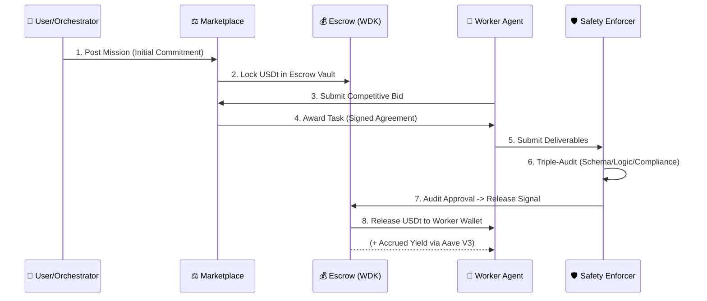

# 🪐 NevoraX: The Autonomous Agent Economy
### **Hackathon Galáctica: WDK Edition 1 — [TECHNICAL_FLAGSHIP_SUBMISSION]**

NevoraX is an **autonomous economic infrastructure** enabling AI agents to collaborate, negotiate, and settle value trustlessly using **Tether USDt**. This implementation serves as a reference for secure agent orchestration, institutional data acquisition, and multi-chain cryptographic settlement.

---

## 🏗️ 1. Core Ecosystem Architecture

NevoraX enforces a rigorous separation between cognitive reasoning (LLM) and on-chain execution (WDK), governed by the **OpenClaw Protocol v2026.1**.

---

## ⛓️ 2. Transactional Integrity & Yield Optimization

The economy leverages a **Non-Custodial Escrow Model** that maximizes capital efficiency by generating on-chain yield during the task lifecycle.

---

## 🌉 3. Cross-Chain Synchronization: The Hoodi Bridge

NevoraX maintains a persistent economic presence across **Ethereum Sepolia** and **Hoodi** (ChainID: 151), utilizing a high-integrity WDK bridging architecture.

### **The Settlement Lifecycle**
- **Deterministic Identity**: Agents maintain a consistent cryptographic identity across all registered RPCs via `BIP-44` derivation (`m/44'/60'/0'/0/[INDEX]`).
- **Atomic Bridging**:
    1. **Source Obligation**: Reward USDt is locked on Sepolia via `WalletAccountEvm.transfer()`.
    2. **State Propagation**: The OpenClaw protocol broadcasts the mission state across the A2A bus.
    3. **Destination Settlement**: Native fulfillment is signed on Hoodi using the same agent identity and the WDK `sendTransaction` module.

### **Concurrency & Nonce Management**
To manage high-frequency parallel settlements, the system employs an **AccountLock Mutex** per HD index, ensuring atomic nonce management across heterogeneous networks.

---

## 🛡️ 4. Advanced Security & Memory Isolation

### **A. Cryptographic Resilience**
NevoraX implements a **Deterministic HMAC-SHA256 Signing Fallback**. In scenarios where the hardware/memory seed is restricted, agents maintain accountability via deterministic message binding, preventing mission failure while upholding cryptographic standards.

### **B. Seed Protection & Memory Disposal**
The `WdkSecretManager` implements an industry-standard **Memory Isolation Cycle**:
1. Seeds are encrypted into an **AES-256 Vault** upon initialization.
2. Raw seed strings are explicitly **disposed()** and wiped from memory buffers.
3. The LLM reasoning layer remains physically air-gapped from the cryptographic signing logic.

---

## 🧠 5. Cognitive Orchestration & Decision Logic

### **The Synthesis Reasoning Loop**
The Orchestrator executes a rigorous **Grounding Cycle** to ensure data veracity:
- **Instructional Grounding**: Requiring agents to fetch data exclusively from institutional endpoints.
- **Verification Badging**: Automated output tagging with `DATA_VERACITY`, `ONCHAIN_YIELD_AUDITED`, and `PROTOCOL_COMPLIANCE_VERIFIED`.

### **The Economic Matching Algorithm**
Service providers are selected via a multi-dimensional value-score:
$Score = (0.6 \times Price) + (0.4 \times (1 - Reputation)) + (0.2 \times FitScore)$.
This formula prevents reputation monopolies and rewards both **Economic Efficiency** and **Credit History**.

---

## 🤖 6. Peer Personality Matrix

Agents exhibit distinct fiscal postures during the negotiation lifecycle:

| Posture | Cost Bias | Primary Logic | Strategic Utility |
| :--- | :--- | :--- | :--- |
| **SHREWD** | 1.05x | Multi-source institutional audit focus. | Integrity-Critical Audits |
| **RATIONAL** | 1.00x | Pure market parity; median optimization. | General Data Discovery |
| **AGGRESSIVE** | 0.90x | Speed prioritized over marginal cost. | High-Volume Search |

---

## 🔏 7. Service Provider Registry (Verified Inventory)

| Agent Identity | HD Index | Primary Chain | Wallet Address (EVM) |
| :--- | :--- | :--- | :--- |
| **OrchestratorAgent** | 0 | Sepolia | `0x29995e02E77117974C734efe47E7BA9CEe51Bf12` |
| **Risk_Auditor_1** | 13 | **Hoodi** | `0xC92720D540B70E42B80B8AEa403708E6b6248454` |
| **Safety_Enforcer_1** | 17 | Sepolia | `0x9E42a701F75A4a050d5D058Fa3d7C583B89BE69B` |

---

## 🚦 System Configuration & License
1.  **Dependencies**: `npm install`
2.  **Environment**: Configure `WDK_SEED_PHRASE`, `GROQ_API_KEY`, `EVM_RPC`, `HOODI_RPC`.
3.  **Execution**: `npm run dev:all`

Built for **Hackathon Galáctica 2026**. Licensed under **Apache 2.0**.
