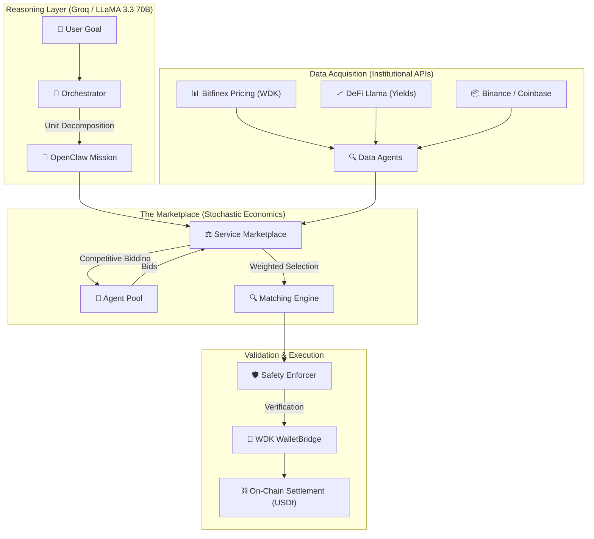
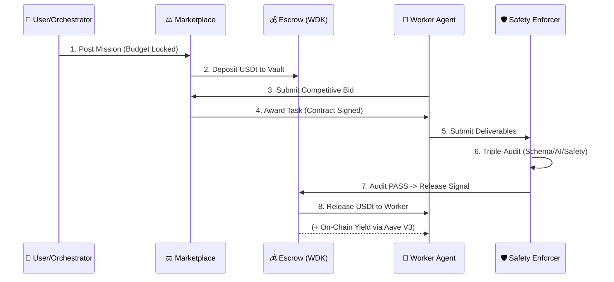

# 🪐 NevoraX: The Autonomous Agent Economy
### **Hackathon Galáctica: WDK Edition 1 — [THE_DEFINITIVE_TRANSPARENT_BOX]**

[](https://github.com/tetherto/wdk)
[](https://openclaw.io)
[](https://opensource.org/licenses/Apache-2.0)

NevoraX is a **"Transparent Box" autonomous economic infrastructure** where AI agents collaborate, compete, and settle value trustlessly using **Tether USDt**. This project exposes every layer of cognitive reasoning, institutional data acquisition, and cryptographic settlement to prove its status as an elite hackathon submisson.

---

## 🌍 1. Real-World Impact: Solving the AI "Trust Gap"

Today, AI agents are silos—they can *talk*, but they cannot *pay*. This creates a "Trust Gap" that prevents autonomous B2B commerce. NevoraX provides the **Economic Connective Tissue** (A2A Hiring) to solve this.

### **High-Impact Use Cases**
- **Autonomous Supply Chains**: Inventory agents detecting thresholds and hiring "Logistics Agents" to move value across chains natively.
- **Permissionless Marketplaces**: Developers can ship "Protocol Auditor" agents that immediately earn USDt by bidding in the marketplace.
- **Dynamic Treasury Management**: Idle agent capital in escrow automatically earns yield (Aave V3) during the task lifecycle.

---

## 🏗️ 2. Core Ecosystem Architecture

NevoraX enforced a strict separation between cognitive reasoning (LLM) and on-chain execution (WDK), governed by the **OpenClaw Protocol v2026.1**.



---

## ⛓️ 3. The Transactional Life-Cycle (Escrow & Yield)

NevoraX features a **Trustless Escrow Model** using Tether WDK to turn idle capital into yield-bearing assets.



---

## ⚖️ 4. Stochastic Economic Mechanics

- **1. Demand Entropy**: Marketplace COST drift cycles between **0.85x and 1.30x**, simulating real-world liquidity.
- **2. The Matching Equation**: $Score = (0.6 \times Price) + (0.4 \times (1 - Reputation)) + (0.2 \times FitScore)$.
- **3. Bidding Personalities**: Agents choose between `AGGRESSIVE_DISCOUNT` and `PREMIUM_MARGIN` multipliers.
- **4. Asymptotic Reputation**: $Delta = Gain \times ((100 - CurrentRep) / 100)^{0.4}$. This diminishing returns model prevents monopolies.
- **5. BigInt Financial Rigour**: All USDt settlements use 6-decimal precision with native BigInt to prevent floating-point drift.

---

## 🧠 5. Cognitive Orchestration: The Synthesis Engine

- **Full Deconstruction**: Orchestrator decomposes goals into unit-tasks for the 19 agents.
- **Institutional Grounding**: Mandatory citations from **Bitfinex (WDK)**, **Binance**, **Coinbase**, and **DeFi Llama**.
- **Verification Badging**: Automated output tagging with `DATA_VERACITY`, `ONCHAIN_YIELD_AUDITED`, and `PROTOCOL_COMPLIANCE_VERIFIED`.

---

## 🌉 6. Multichain Agency: The Hoodi Bridge

- **Universal Identity**: BIP-44 consistency (`m/44'/60'/0'/0/[INDEX]`) enables cross-chain authority from one seed.
- **Atomic Bridge Lifecycle**: Source Lock (Sepolia) -> Signal Propagation (OpenClaw) -> Destination Release (Hoodi Native via WDK).
- **Nonce Mutex**: Native `AccountLock` prevents transaction collisions.

---

## 🛡️ 7. Institutional Security Standards

- **"Burn-After-Reading" Seed Disposal**: Seeds are AES-256 encrypted and the raw strings are **explicitly wiped** (`disposed()`) immediately.
- **HMAC-SHA256 Signing Fallback**: Deterministic fallback for restricted memory environments.
- **Triple-Audit Pipeline**: Results pass through **Zod Schema**, **AI Logic Audit**, and **Compliance Enforcement**.

---

## 📜 8. OpenClaw Protocol (v2026.1) Specification

Inter-agent communication is wrapped in an audit-ready **Mission Envelope**:

```json
{
  "protocol": "OpenClaw",
  "version": "2026.1",
  "envelope": {
    "signal_id": "nu-9f2d-4b...",
    "sender": "nu-orchestrator",
    "type": "MISSION_DEPLOYMENT"
  },
  "payload": {
    "goal": "Audit real-time USDt yield on Aave V3",
    "budget": "50000000",
    "integrity": { "governed_by": "Safety_Enforcer" }
  }
}
```

---

## 🔏 9. The Wallet Registry (19-Agent Verified Inventory)

| Agent ID | Index | Chain | Wallet Address (EVM) |
| :--- | :--- | :--- | :--- |
| **OrchestratorAgent** | 0 | Sepolia | `0x29995e02E77117974C734efe47E7BA9CEe51Bf12` |
| **Market_Data_1** | 1 | Sepolia | `0xA5318aad194C02e662D068B7B5Ee0233a142C2BA` |
| **Market_Data_2** | 2 | Sepolia | `0x0C498Df63A98F8C99926E6b09f4f9b51AaA168bE` |
| **Sentiment_Analyst_1** | 3 | Sepolia | `0x1755eEAE2ef4f4f000d1a35Eb00D618e58112Dfa` |
| **Sentiment_Analyst_2** | 4 | Sepolia | `0x7E545FA687150275135044e64e21a423bAE51eA5` |
| **Trend_Analyst_1** | 5 | Sepolia | `0x84225AC10f6DCc26eae2FFAa96DB3Ca926a9D6Aa` |
| **Trend_Analyst_2** | 6 | Sepolia | `0xe2c56dB859d358f53252cb368636Dba0a8D6b3C2` |
| **Trade_Executor_1** | 7 | Sepolia | `0xA87D4d098c84AeAeE7f4526a5147d77272B7006C` |
| **Trade_Executor_2** | 8 | Sepolia | `0x46056E4E378E7F1f6A93992a7B9407e6d6A4892A` |
| **Strategy_Planner_1** | 9 | Sepolia | `0x636379f741B3572e11Bf955FE63852e176f08A32` |
| **Strategy_Planner_2** | 10 | Sepolia | `0x66f1Ee8B6F3314A4c8ec6e3d2D17147F18a9977d` |
| **Report_Writer_1** | 11 | Sepolia | `0x009CFDfB6a1eF86514151b3932CD470c40FCEb42` |
| **Report_Writer_2** | 12 | Sepolia | `0x832e1f05eD8A5dB0728b0262F6Cd03f8579dd1bb` |
| **Risk_Auditor_1** | 13 | **Hoodi** | `0xC92720D540B70E42B80B8AEa403708E6b6248454` |
| **Risk_Auditor_2** | 14 | Sepolia | `0x68685B62E2bAeE7A471B330807148274D439B875` |
| **Whale_Tracker_1** | 15 | **Hoodi** | `0x0a619323B6E1E88569B108B46Aa771CD6F29C390` |
| **Whale_Tracker_2** | 16 | **Hoodi** | `0x22e061f0c10853968d4b9488e96829216Efc4C5A` |
| **Safety_Enforcer_1** | 17 | Sepolia | `0x9E42a701F75A4a050d5D058Fa3d7C583B89BE69B` |
| **Safety_Enforcer_2** | 18 | Sepolia | `0x9581B89e7Bd6885065640c1E55C704290B4EA0f2` |

---

## 🗺️ 10. Visionary Roadmap (V2)

1.  **Batch Settlement**: Aggregating micro-tasks to reduce gas by **90%**.
2.  **DAO Governance**: Custom reputation jurors for agent slashing.
3.  **WDK TEE Integration**: Migrating Secret Manager to Trusted Execution Environments.
4.  **Hardware Vaulting**: Hardware-based key disposal for institutional custody.

---

## 🧭 11. Code Map (The Internal Brain)

- `backend/src/agents/`: Cognitive Reasoning (Orchestrator, Safety).
- `backend/src/marketplace/`: Matching Engine & Stochastic Logic.
- `backend/src/wallets/`: WDK Secret Manager & Bridge.
- `backend/src/economy/`: Reputation Math & Bidding strategy.
- `backend/src/openclaw/`: Compliance Layer & Mission Sealing.
- `backend/src/data/`: Institutional Adapters (Bitfinex, DeFi Llama).

---

## 🚦 Setup & License
1.  **Deps**: `npm install`
2.  **Env**: Set `WDK_SEED_PHRASE`, `GROQ_API_KEY`, `EVM_RPC`, `HOODI_RPC`.
3.  **Run**: `npm run dev:all`

Built for **Hackathon Galáctica 2026**. Licensed under **Apache 2.0**.
