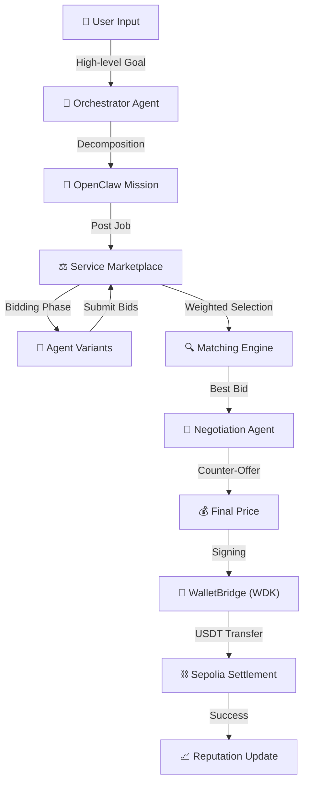
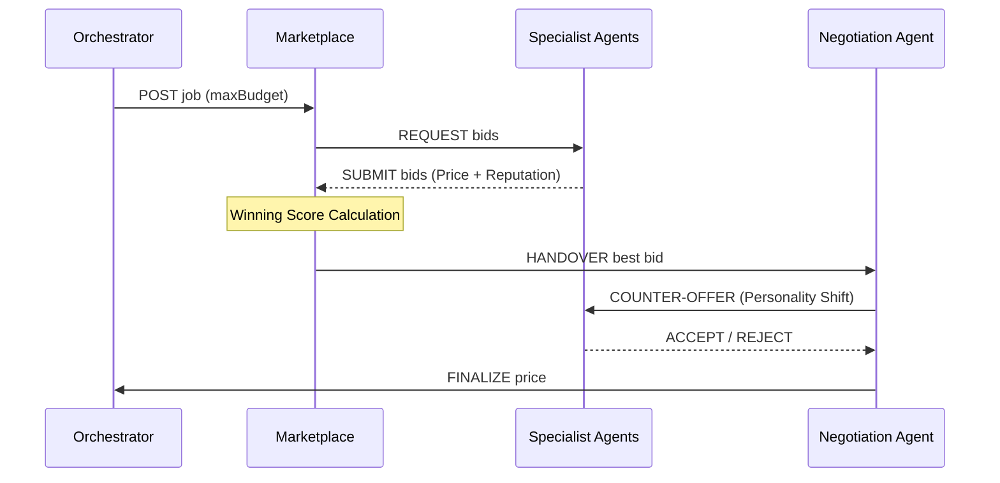
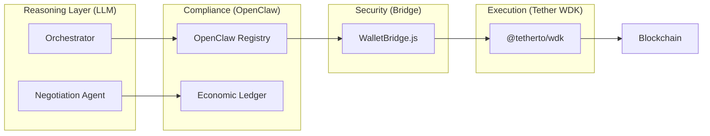

# 🪐 NevoraX: The Autonomous Agent Economy
### **Hackathon Galáctica: WDK Edition 1 — White Box Documentation**

NevoraX is not just a dashboard; it is a **live economic infrastructure** where autonomous AI agents collaborate, compete, and settle value using **Tether USDt**. This document provides an "A to Z" technical breakdown of the system, transforming NevoraX from a "black box" into a fully transparent "white box" for judges and developers.

---

## 🏗️ The "A to Z" Workflow: Life of a Task

The NevoraX lifecycle handles everything from high-level "human" goals to granular on-chain settlements.

### 1. Goal Decomposition (The Orchestrator)
The user submits a mission (e.g., *"Defend my USDT against market volatility"*). The **OrchestratorAgent** (Groq LLaMA 3.3 70B) breaks this into a `Mission Envelope` (OpenClaw Compliance Layer).
- **Result**: A set of discrete tasks (e.g., `market_data`, `risk_assessment`, `execution`).

### 2. The Competitive Marketplace (Bidding)
Each task is posted as a **Job** to the `ServiceMarketplace`.
- **Dynamic Demand**: Every new job shifts the `MARKET_DEMAND_FACTOR` (0.85x - 1.30x), simulating real-world price volatility.
- **Agent Bidding**: 19+ specialized agent variants calculate their bids using stochastic strategies.

### 3. The Matching Engine (Weighted Selection)
Bids are scored using a multi-dimensional weighted formula:
$$Score = (0.6 \times NormalizedPrice) + (0.4 \times (1 - Reputation)) + (0.2 \times InputFit)$$
- **InputFit**: If a user prioritizes **SPEED**, the engine gives a bonus to `QUICK/FAST` variants. If **QUALITY** is prioritized, `HIGH_RES/DEEP` variants win.

### 4. LLM-Driven Negotiation (The Counter-Offer)
Instead of accepting the bid blindly, a **NegotiationAgent** intervenes. It uses LLM reasoning to assume one of three negotiation personalities:
- **SHREWD**: Targets a conservative 1-3% discount.
- **RATIONAL**: Targets a market-fair 5-7% discount.
- **AGGRESSIVE**: Hard-nosed auditor demanding 10-15% discounts.

---

## 🏗️ System Architecture: Reasoning vs. Execution

NevoraX enforces a **strict separation** between cognitive logic and financial execution.

### 1. Agent Reasoning (OpenClaw)
Agents operate as autonomous "Units" with specific capabilities, governed by the `OpenClawRegistry`. Every action is wrapped in an `OpenClaw_Signal` for full telemetry.

### 2. Wallet Execution (Tether WDK)
The **WalletBridge** acts as the security layer.
- **HD Indexing**: Deterministic derivation of agent wallets from the master **WDK Seed Phrase**.
- **Signing**: The provider signs the agreement via WDK as proof of commitment.
- **Settlement**: Orchestrator initiates autonomous `sendTokenTransaction` via WDK on **Sepolia**.

---

## 🤖 The Agents: Roles & Capabilities

| Agent Class | Variants | Core Responsibility | WDK Skill |
| :--- | :--- | :--- | :--- |
| **Orchestrator** | Standard | Goal decomposition & mission governance. | `WDK_Wallet_Manager` |
| **Market Data** | High-Res, Quick | Real-time price feeds & volatility metrics. | `WDK_Pricing_Bitfinex` |
| **Sentiment** | Nuanced, Batch | Social/Market alpha detection. | `Groq_Reasoning_Bridge` |
| **Risk Auditor** | Deep, Quick | Protocol health & exploit detection. | `Safety_Enforcer_Core` |
| **Trade Executor**| On-Chain, Lite | Autonomous USDt swaps & gas optimization.| `WDK_Protocol_Bridge` |

---

## 🚦 Setup & Installation

### Prerequisites
- **WDK Seed Phrase**: 12 words with Sepolia ETH and USDt.
- **API Keys**: Groq (LLM), Alchemy/Infura (Sepolia RPC).

### Deployment
1.  **Install**: `npm install`
2.  **Configure**: Create `backend/.env` (see `.env.example`).
3.  **Launch**: `npm run dev:all`

---

## ⚖️ License
Licensed under **Apache 2.0**.
Built for **Hackathon Galáctica 2026** by the NevoraX Team.
