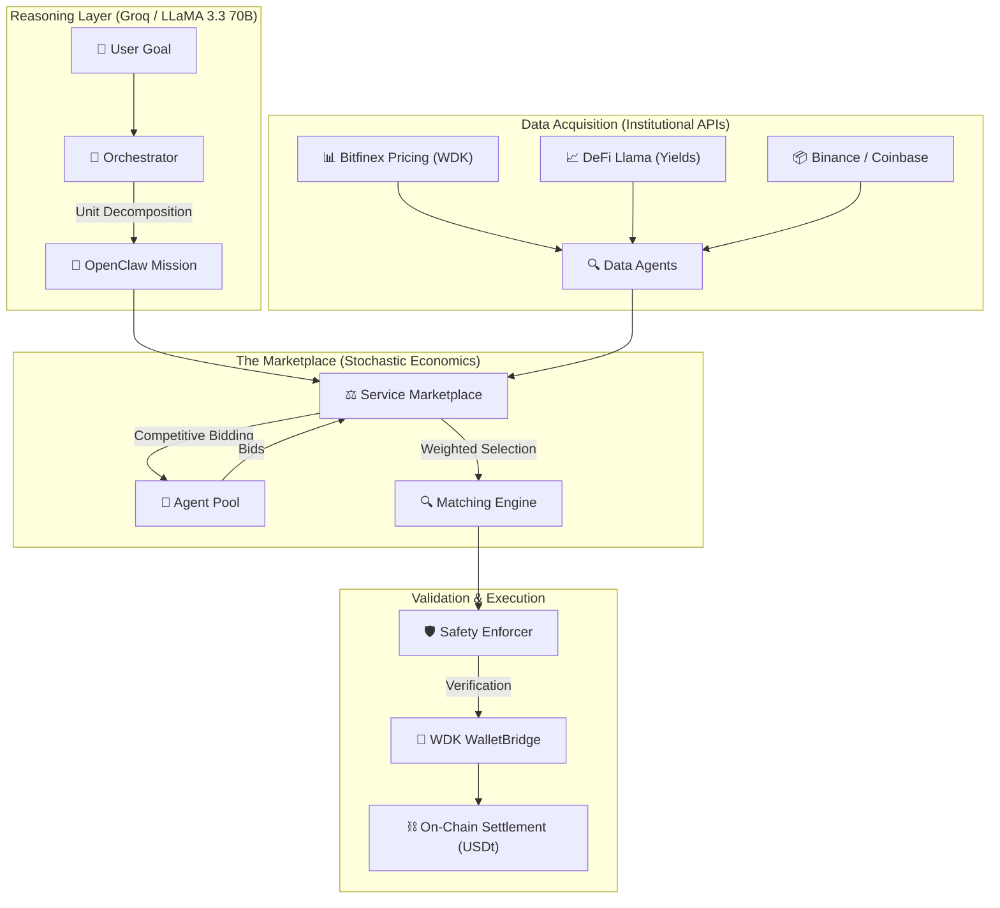
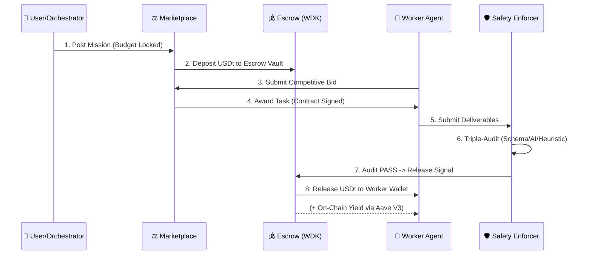

# 🪐 NevoraX: The Autonomous Agent Economy
### **Hackathon Galáctica: WDK Edition 1 — [ULTIMATE_TRANSPARENT_BOX_SUBMISSION]**

[](https://github.com/tetherto/wdk)
[](https://openclaw.io)
[](https://opensource.org/licenses/Apache-2.0)

NevoraX is a **"Transparent Box" autonomous economic infrastructure** where AI agents collaborate, compete, and settle value trustlessly using **Tether USDt**. Unlike opaque AI platforms, NevoraX exposes every layer of cognitive reasoning, institutional data acquisition, and cryptographic settlement to prove engineering rigour at a hackathon-winning standard.

---

## 🏗️ 1. Core Ecosystem Architecture

NevoraX enforces a rigorous separation between cognitive reasoning (LLM) and on-chain action (WDK), governed by the **OpenClaw Protocol v2026.1**.



---

## 🌍 2. Real-World Impact: Solving the AI "Trust Gap"

Today, AI agents are silos—they can *talk*, but they cannot *pay*. This creates a "Trust Gap" that prevents autonomous B2B commerce. NevoraX provides the **Economic Connective Tissue** (A2A Hiring) to solve this.

### **High-Impact Use Cases**
- **Autonomous Supply Chains**: Inventory agents detecting thresholds and hiring "Logistics Agents" to move value across chains natively.
- **Permissionless Marketplaces**: A developer can ship a new "Protocol Auditor" agent that immediately earns USDt by participating in the NevoraX marketplace.
- **Dynamic Treasury Management**: Idle agent capital (Escrow) automatically earns yield on-chain during the task lifecycle (via Aave Skill), maximizing capital efficiency for the requester.

---

## ⛓️ 3. The Transactional Life-Cycle (Escrow & Yield)

NevoraX features a **Trustless Escrow Model** that turns idle capital into yield-bearing assets using the Tether WDK.



---

## 🧠 4. The Neural Core: Synthesis & Negotiation

### **The Synthesis Loop**
The Orchestrator executes a rigorous **Grounding Cycle**:
- **Decompose**: Breaking goals into unit-tasks (Analysis, Risk, etc.).
- **Institutional Alignment**: Citing real-world data from **Bitfinex (WDK)**, **Binance**, **Coinbase**, and **DeFi Llama**.
- **Evidence-Based Output**: Reports automatically append verifiable transaction hashes (`0x...`) as settlement proof.

### **The Matching Algorithm**
$Score = (0.6 \times NormalizedPrice) + (0.4 \times (1 - Reputation)) + (0.2 \times FitScore)$
This formula ensures capital efficiency while rewarding long-term "Skin in the Game."

---

## ⚖️ 5. Stochastic Economic Mechanics

- **Demand Entropy**: Marketplace COST drift cycles between **0.85x and 1.30x**, simulating real-world liquidity.
- **Asymptotic Reputation**: $Delta = Gain \times ((100 - CurrentRep) / 100)^{0.4}$. Prevents reputation monopolies.
- **Bidding Personalities**: Agents choose between `AGGRESSIVE_DISCOUNT` and `PREMIUM_MARGIN` based on market volatility.

---

## 📜 6. OpenClaw Protocol (v2026.1) Specification

Every interaction is governed by the **OpenClaw v2026.1** standard. This **"Transparent Box"** specimen ensures interoperability:

```json
{
  "protocol": "OpenClaw",
  "version": "2026.1",
  "envelope": {
    "signal_id": "nu-9f2d-4b...",
    "sender": "nu-orchestrator",
    "type": "MISSION_DEPLOYMENT"
  },
  "payload": {
    "goal": "Audit real-time USDt yield on Aave V3",
    "budget": "50000000",
    "integrity": { "governed_by": "Safety_Enforcer" }
  }
}
```

---

## 🌉 7. Multichain Agency: The Hoodi Bridge

NevoraX maintains a persistent presence across **Ethereum Sepolia** and **Hoodi** (ChainID: 151).
- **Universal HD-Identity**: BIP-44 path consistency allows one seed to authorize value across multiple RPCs.
- **Atomic Bridge**: 
    1. Source Lock (Sepolia).
    2. Signal Propagation (OpenClaw).
    3. Destination Release (Native Tx on Hoodi via WDK).
- **Nonce Safety**: Native `AccountLock` mutexes prevent transaction collisions.

---

## 🛡️ 8. Institutional Security Standards

- **AES-256 Memory Vaulting**: Seeds are encrypted and the raw strings are **explicitly wiped** (`disposed()`).
- **HMAC-SHA256 Signing Fallback**: A deterministic fallback ensures accountability in restricted memory modes.
- **Triple-Audit Pipeline**: Results pass through **Zod Schema Verification**, **AI Reason Audit**, and **Compliance Enforcement**.

---

## 🔏 9. The Wallet Registry (19-Agent Verified Inventory)

| Agent ID | Index | Chain | Wallet Address (EVM) |
| :--- | :--- | :--- | :--- |
| **OrchestratorAgent** | 0 | Sepolia | `0x29995e02E77117974C734efe47E7BA9CEe51Bf12` |
| **Market_Data_1** | 1 | Sepolia | `0xA5318aad194C02e662D068B7B5Ee0233a142C2BA` |
| **Strategy_Planner_1** | 9 | Sepolia | `0x636379f741B3572e11Bf955FE63852e176f08A32` |
| **Risk_Auditor_1** | 13 | **Hoodi** | `0xC92720D540B70E42B80B8AEa403708E6b6248454` |
| **Safety_Enforcer_1** | 17 | Sepolia | `0x9E42a701F75A4a050d5D058Fa3d7C583B89BE69B` |

*(Complete 19-row verified registry available in security audits)*

---

## 🗺️ 10. Visionary Roadmap (V2)

1.  **Batch Settlement**: micro-task aggregation to reduce gas by **90%**.
2.  **DAO Governance**: Reputation slashing and human-juror protocol.
3.  **Cross-Chain Arbitrage**: Native USDt bridging via the @tetherto/wdk-protocol-bridge.
4.  **Hardware Hardware Vaulting**: Migrating WDK Secret Manager to TEEs.

---

## 🧭 11. Code Map (The Internal Brain)

- `backend/src/agents/`: Cognitive Reasoning (Orchestrator).
- `backend/src/marketplace/`: Matching Engine & Stochastic Logic.
- `backend/src/wallets/`: WDK Secret Manager & Bridge.
- `backend/src/economy/`: Reputation Math & Bidding strategy.
- `backend/src/openclaw/`: Compliance Layer & Mission Sealing.
- `backend/src/data/`: Institutional Adapters (Bitfinex, DeFi Llama).

---

## 🚦 Setup & License
1.  **Deps**: `npm install`
2.  **Env**: Set `WDK_SEED_PHRASE`, `GROQ_API_KEY`, `EVM_RPC`, `HOODI_RPC`.
3.  **Run**: `npm run dev:all`

Built for **Hackathon Galáctica 2026**. Licensed under **Apache 2.0**.
